# Sovelluksen nimi: **MyLens**

---

## Kuvaus:

**MyLens** on sosiaalinen medianjakoalusta, jossa käyttäjät voivat julkaista kuvia ja videoita, tykätä ja kommentoida vapaasti julkaisuja sekä tallentaa mediaa suosikeiksi. Käyttäjät voivat vapaasti seurata muita käyttäjiä. Sovellus on ottanut inspiraatiota suosituimpien sosiaalisten medioiden ja viihdealustojen käyttöliittymistä.

---

## Kuvat käyttöliittymästä
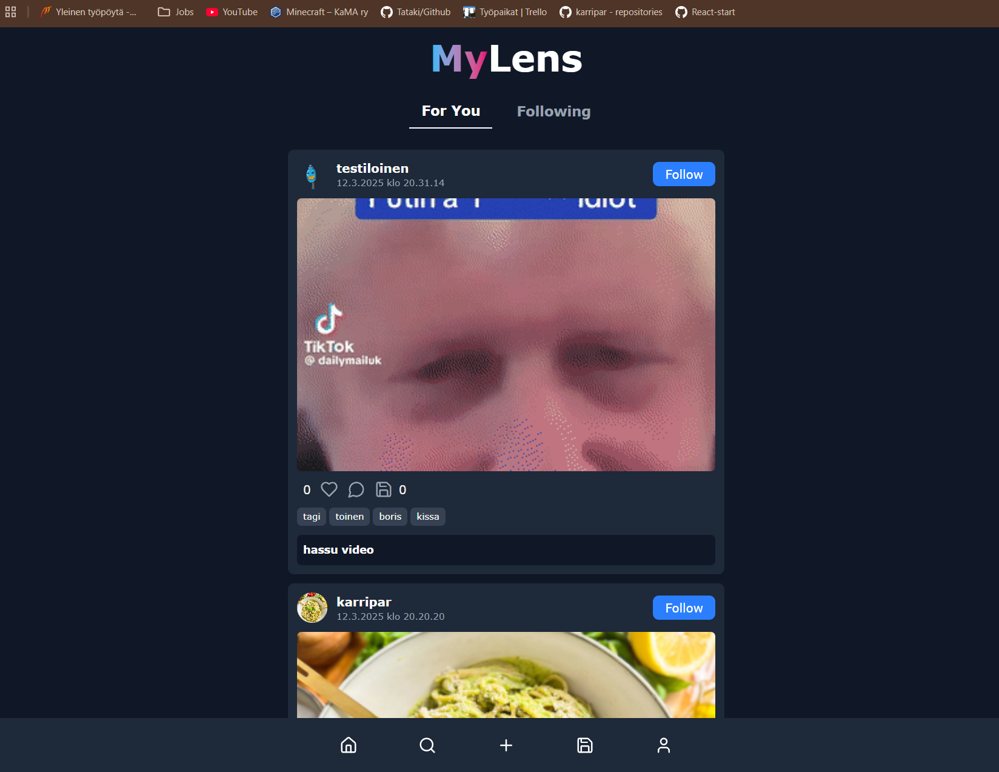
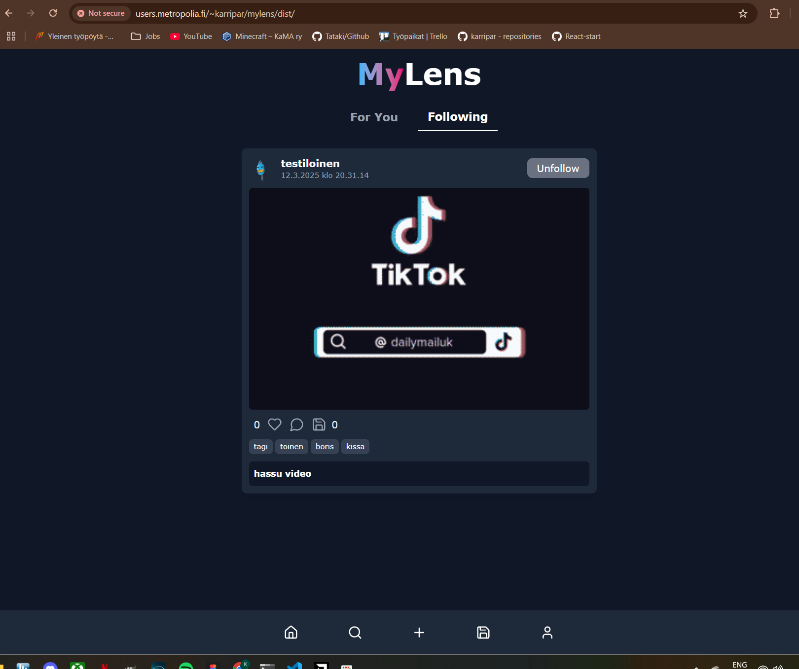
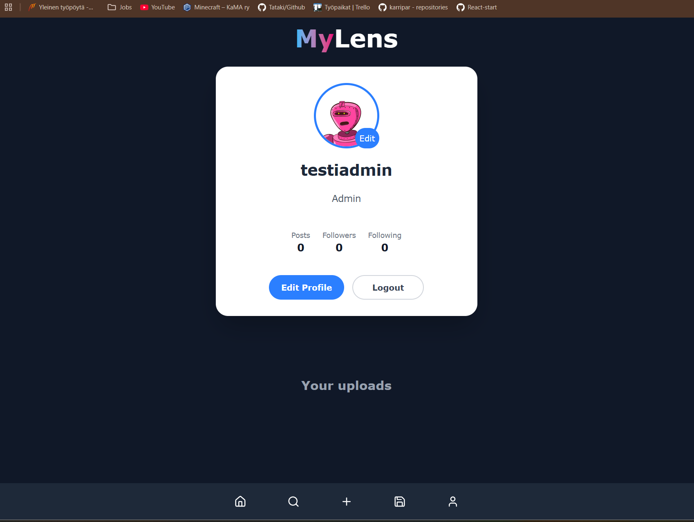
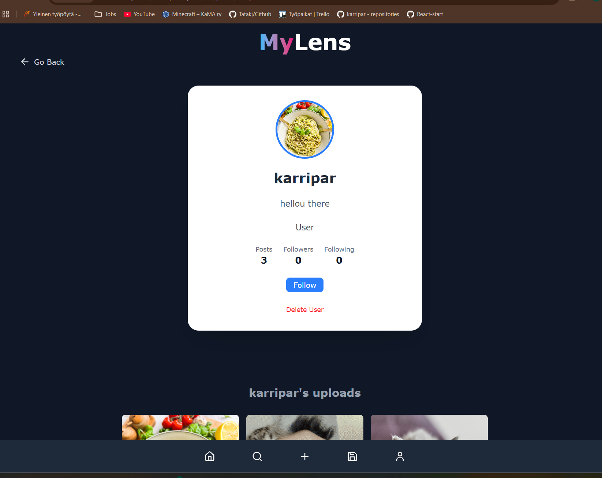
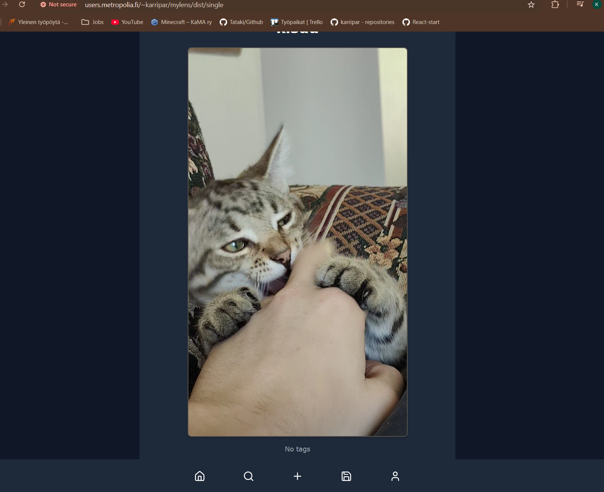
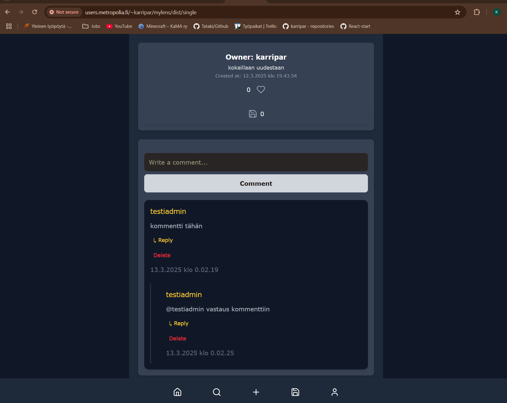
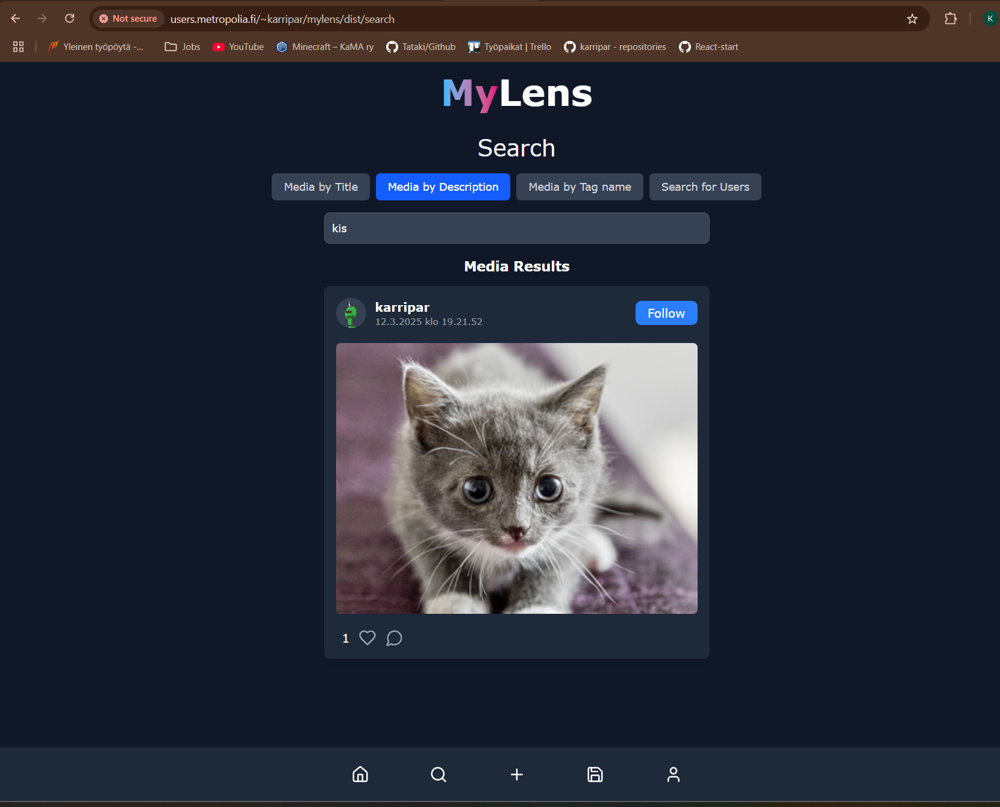
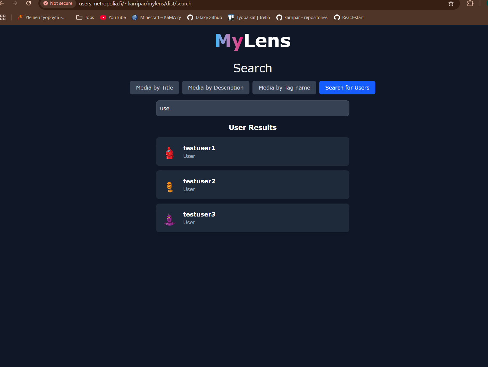
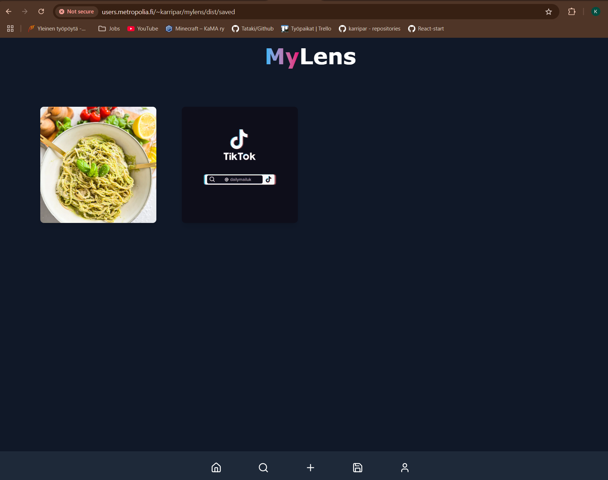
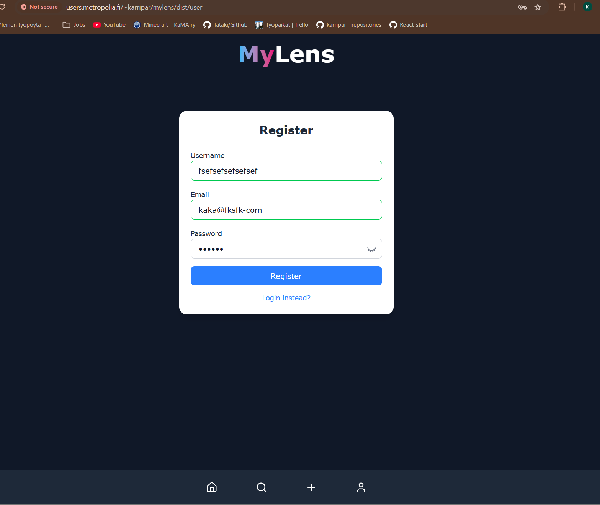

---

## Linkit:

### Backend-sovellus:
**[Auth-haara](https://10.120.32.64/auth/api/v1)**
**[Media-haara](https://10.120.32.64/media/api/v1)**
**[Upload-haara](https://10.120.32.64/upload/api/v1)**

### Apidoc-dokumentaatio:
**[Auth-apidoc](https://users.metropolia.fi/~karripar/mylens/apidoc/auth/)**
**[Media-apidoc](https://users.metropolia.fi/~karripar/mylens/apidoc/media/)**
**[Upload-apidoc](https://users.metropolia.fi/~karripar/mylens/apidoc/upload/)**

## Toiminnot:

### 1. Käyttäjäprofiilit:

- Käyttäjät voivat luoda profiilin, johon he voivat lisätä tietoja itsestään
- Profiilin avulla saa auki mahdollisuuden tykätä, kommentoida, jakaa mediaa sekä seurata käyttäjiä.
- Käyttäjän omaava saa auki "following"-feedin jossa näkyy vain seurattujen käyttäjien media.
- Normaali käyttäjä voi poistaa julkaisunsa tai halutessaan koko tilinsä, joka poistaa myös tilin julkaiseman sisällön.
- Profiilikuvan lisääminen ja vaihtaminen. Vaihtaessa profiilikuvan, vanha kuva poistetaan myös taustapalvelun tiedostoista.
- Julkisesti esillä olevien tietojen muokkaaminen, kuten profiilin kuvauksen ja käyttäjänimen muokkaus.
- Ilman aktiivista käyttäjätiliä interaktiivisuus on hyvin rajallista.
- Muiden käyttäjien julkaisut näkee vierailemalla heidän tilillään.

### 2. Materiaalin jakaminen:

- Käyttäjät voivat ladata ja jakaa mediatiedostoja, eli kuvia ja videoita.
- Mahdollisuus lisätä kuvauksia ja tageja (esim. aihe), jotta materiaalin löytäminen olisi helpompaa.
- Julkaisussa olevaa tagia klikkaamalla tai oikeaan osoitteeseen navigoimalla saa esiin kaikki saman tagin sisältävät julkaisut.

### 3. Haku ja suodatus:

- Materiaalit voidaan etsiä hakusanojen, nimen, aiheen tai tagien avulla.
- Haku toimii dynaamisesti ilman haku-painikkeen painamista.
- Mahdollisuus hakea myös muita käyttäjiä nimeltä.

### 4. Keskustelu ja kommentointi:

- Käyttäjät voivat kommentoida ja keskustella jakamistaan medioista kommenttikentissä. Sovelluksessa on mahdollisuus vastata kommentteihin, jolloin kommentti liitetään alkuperäisen kommentin alle.

### 5. Ylläpitäjien oikeudet

- Ylläpitäjät voivat poistaa kommentteja (oikeus vain ylläpitäjillä), käyttäjien julkaisuja ja myös tilejä.

### 6. Tiedossa olevat ongelmat ja puutteet:

- Huom. taustapalvelussa vanhan tiedoston poistaminen ei onnistu koska DELETE ei luote ecloudin tarjoamaan SSL-sertifikaattiin. Toiminnallisuus on testattu hyvin toimivaksi localhostilla mutta taustapalvelussa tiedoston poistaminen ei toimi levyltä vaikka median poistaminen toimii (esim. profiilikuva). ERROR: Self-signed sertificate.

- Alkuperäisestä suunnitelmasta poiketen ilmoitukset ei ole käytössä vaikka niille tehtiinkin endpointit.

## Tekninen toteutus:

- **Frontend:** React ja TypeScript.
- **Backend:** Node.js ja Express (RESTful-arkkitehtuuri).
- **Tietokanta:** MySQL/MariaDB käyttäjätietojen, materiaalien ja keskusteluiden tallentamiseen.
- **Tiedostojen hallinta:** Tiedostojen lataus ja tallennus
- **Autentikointi:** Käyttäjien rekisteröinti ja kirjautuminen (JWT).
- **Responsiivinen käyttöliittymä:** Tailwind CSS
- **Progressiivinen web-sovellus:** Vite PWA toiminnallisuus.

## Kolmannen osapuolen kirjastot ja lisäosat:

- **[Lucide React](https://lucide.dev/guide/):** Vapaasti käytettävä ikonikirjasto Reactille.
- **[Robohash](https://robohash.org/):** Oletusprofiilikuvat käyttäjille.
- **[FFmpeg](https://www.ffmpeg.org/about.html):** Multimedia framework mediatiedostojen käsittelylle taustapalvelussa.
- **[Zustand](https://zustand.docs.pmnd.rs/getting-started/introduction):** Kommenttien, tykkäysten ja suosikkien tilan ja arvojen varastoimiseen sekä käsittelyyn.
- **[DrawDB](https://www.drawdb.app/):** Tietokantamallin piirtämistä ja havainnollistamista varten.

- Tekoälyä käytetty etenkin logiikkaan jolla sai indeksoitua kommentit ja asetettua ne oikeiden isäntäkommenttien alle. Eli vastaukset oikeiden kommenttien alle.

## Referenssit:
- **[FFmpegin asennus Windowsille, ongelma tiedostojen polussa](https://www.wikihow.com/Install-FFmpeg-on-Windows)**
- **[FFmpegin asennus Linux virtuaalikoneelle (Fedora)](https://www.cyberciti.biz/faq/how-to-install-ffmpeg-on-fedora-linux-using-dnf/)**: Asennus vaatii hieman kikkailua. Asenna ohjeiden mukaan ja katso upload-serverin makeVideoThumbnail.ts tiedostosta kuinka asettaa polku ffmpeg ja ffprobe tiedostoille. Luonnollisesti Linux-ympäristössä on oma polkunsa --> '/bin/jaadajaada' jne. Ilman polkujen määrittämistä ffmpeg ei löytänyt ffprobea.

---

## Tietokannan kuvaus:

# mylens documentation

## Summary

- [Introduction](#introduction)
- [Database Type](#database-type)
- [Table Structure](#table-structure)
  - [Users](#Users)
  - [UserLevels](#UserLevels)
  - [ProfilePictures](#ProfilePictures)
  - [MediaItems](#MediaItems)
  - [Tags](#Tags)
  - [MediaTags](#MediaTags)
  - [Comments](#Comments)
  - [Likes](#Likes)
  - [Follows](#Follows)
  - [Favorites](#Favorites)
- [Relationships](#relationships)
- [Database Diagram](#database-Diagram)

## Introduction

## Database type

- **Database system:** MySQL

## Table structure

### Users

| Name              | Type         | Settings                                | References          | Note |
| ----------------- | ------------ | --------------------------------------- | ------------------- | ---- |
| **user_id**       | INTEGER      | 🔑 PK, not null , unique, autoincrement |                     |      |
| **username**      | VARCHAR(255) | not null , unique                       |                     |      |
| **password_hash** | VARCHAR(255) | not null                                |                     |      |
| **email**         | VARCHAR(255) | not null , unique                       |                     |      |
| **bio**           | TEXT(65535)  | not null                                |                     |      |
| **user_level_id** | INTEGER      | not null                                | Users.user_level_id |      |
| **created_at**    | TIMESTAMP    | not null                                |                     |      |

### UserLevels

| Name              | Type         | Settings                                | References | Note |
| ----------------- | ------------ | --------------------------------------- | ---------- | ---- |
| **user_level_id** | INTEGER      | 🔑 PK, not null , unique, autoincrement |            |      |
| **level_name**    | VARCHAR(255) | not null                                |            |      |

### ProfilePictures

| Name                   | Type         | Settings                                | References    | Note |
| ---------------------- | ------------ | --------------------------------------- | ------------- | ---- |
| **profile_picture_id** | INTEGER      | 🔑 PK, not null , unique, autoincrement |               |      |
| **user_id**            | INTEGER      | not null                                | Users.user_id |      |
| **filename**           | VARCHAR(255) | not null                                |               |      |
| **media_type**         | VARCHAR(255) | not null                                |               |      |
| **filesize**           | INTEGER      | not null                                |               |      |
| **created_at**         | TIMESTAMP    | not null                                |               |      |

### MediaItems

| Name            | Type         | Settings                                | References    | Note |
| --------------- | ------------ | --------------------------------------- | ------------- | ---- |
| **media_id**    | INTEGER      | 🔑 PK, not null , unique, autoincrement |               |      |
| **user_id**     | INTEGER      | not null                                | Users.user_id |      |
| **filename**    | VARCHAR(255) | not null                                |               |      |
| **thumbnail**   | VARCHAR(255) | not null                                |               |      |
| **filesize**    | INTEGER      | not null                                |               |      |
| **media_type**  | VARCHAR(255) | not null                                |               |      |
| **title**       | VARCHAR(255) | not null                                |               |      |
| **description** | TEXT(65535)  | not null                                |               |      |
| **created_at**  | TIMESTAMP    | not null                                |               |      |

### Tags

| Name         | Type         | Settings                                | References | Note |
| ------------ | ------------ | --------------------------------------- | ---------- | ---- |
| **tag_id**   | INTEGER      | 🔑 PK, not null , unique, autoincrement |            |      |
| **tag_name** | VARCHAR(255) | not null                                |            |      |

### MediaTags

| Name             | Type    | Settings                                | References          | Note |
| ---------------- | ------- | --------------------------------------- | ------------------- | ---- |
| **media_tag_id** | INTEGER | 🔑 PK, not null , unique, autoincrement |                     |      |
| **media_id**     | INTEGER | not null                                | MediaItems.media_id |      |
| **tag_id**       | INTEGER | not null                                | Tags.tag_id         |      |

### Comments

| Name                     | Type        | Settings                                | References          | Note |
| ------------------------ | ----------- | --------------------------------------- | ------------------- | ---- |
| **comment_id**           | INTEGER     | 🔑 PK, not null , unique, autoincrement |                     |      |
| **media_id**             | INTEGER     | not null                                | MediaItems.media_id |      |
| **user_id**              | INTEGER     | not null                                | Users.user_id       |      |
| **comment_text**         | TEXT(65535) | not null                                |                     |      |
| **reference_comment_id** | INTEGER     | not null                                | Comments.comment_id |      |
| **created_at**           | TIMESTAMP   | not null                                |                     |      |

### Likes

| Name           | Type      | Settings                                | References          | Note |
| -------------- | --------- | --------------------------------------- | ------------------- | ---- |
| **like_id**    | INTEGER   | 🔑 PK, not null , unique, autoincrement |                     |      |
| **media_id**   | INTEGER   | not null                                | MediaItems.media_id |      |
| **user_id**    | INTEGER   | not null                                | Users.user_id       |      |
| **created_at** | TIMESTAMP | not null                                |                     |      |

### Follows

| Name            | Type      | Settings                                | References    | Note |
| --------------- | --------- | --------------------------------------- | ------------- | ---- |
| **follow_id**   | INTEGER   | 🔑 PK, not null , unique, autoincrement |               |      |
| **follower_id** | INTEGER   | not null                                | Users.user_id |      |
| **followed_id** | INTEGER   | not null                                | Users.user_id |      |
| **created_at**  | TIMESTAMP | not null                                |               |      |

### Favorites

| Name            | Type      | Settings                                | References          | Note |
| --------------- | --------- | --------------------------------------- | ------------------- | ---- |
| **favorite_id** | INTEGER   | 🔑 PK, not null , unique, autoincrement |                     |      |
| **user_id**     | INTEGER   | not null                                | Users.user_id       |      |
| **media_id**    | INTEGER   | not null                                | MediaItems.media_id |      |
| **created_at**  | TIMESTAMP | not null                                |                     |      |

## Relationships

- **ProfilePictures to Users**: one_to_one
- **Users to UserLevels**: one_to_one
- **Favorites to MediaItems**: one_to_one
- **Favorites to Users**: one_to_one
- **Likes to MediaItems**: one_to_one
- **Likes to Users**: one_to_one
- **MediaTags to MediaItems**: one_to_one
- **MediaTags to Tags**: one_to_one
- **Comments to MediaItems**: one_to_one
- **Comments to Users**: one_to_one
- **Comments to Comments**: one_to_one
- **Follows to Users**: one_to_one
- **Follows to Users**: one_to_one
- **MediaItems to Users**: one_to_one

## Database Diagram

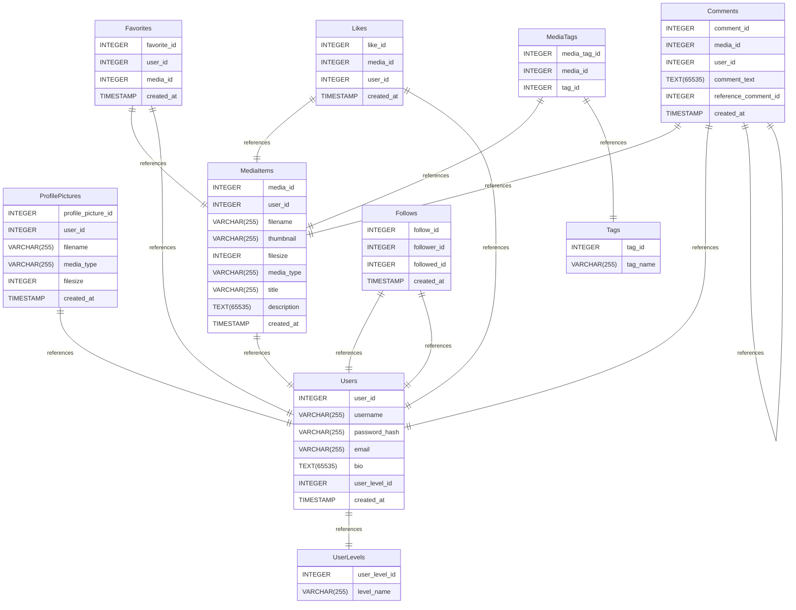
